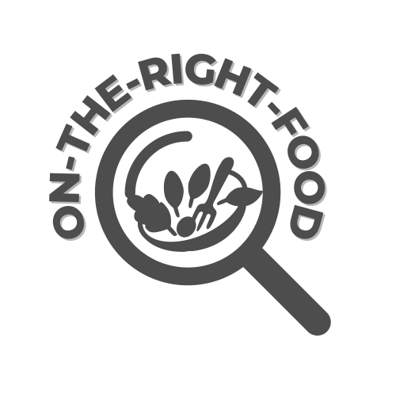
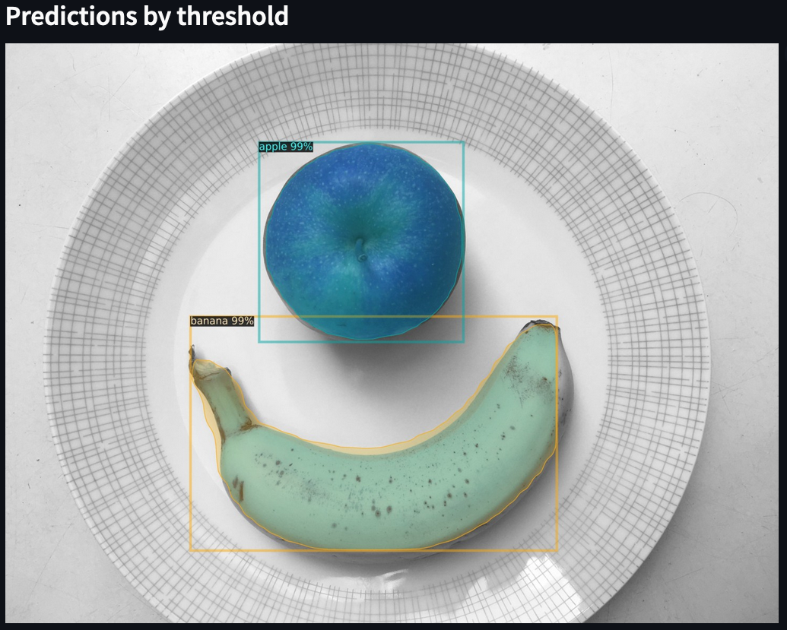
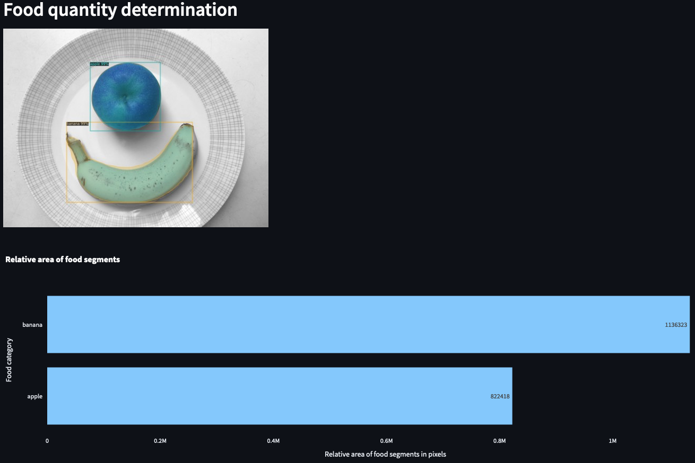

# On The Right Food - Food segmentation and categorization of real-world food images

## **About our Project**

This is our Capstone project for the Data Science Bootcamp at neuefische.

### **Introduction**

Food plays a crucial role in our daily lives. Image-based food recognition is therefore quite essential and helpful in various areas, including personal diet management, healthcare and sustainability.

Our project "On The Right Food" utilized image processing and machine learning to simplify and streamline this process. We aimed to build and train a deep learning model to detect and segment foods from images. By training the model with the real-world food [dataset from AICrowd](https://www.aicrowd.com/challenges/food-recognition-benchmark-2022), we tackled the challenges posed by the diversity and complexity of actual food images. 

For proof-of-concept, our team also created a user-friendly demo web application. With our app, you can load a (self-taken) picture with food and get a prediction of where the food is, what space it occupies and what food category it belongs to.

### **Future application**

A future application could be to estimate the absolute amount of food, e.g. through LiDAR scanner or similar technologies used for augmented reality and combine the values with a nutrition database. This would allow users and health personnel to easily check and track their food intake.

### **Team members**
- Frederik Vath - [LinkedIn](https://www.linkedin.com/in/frederik-vath-1b91ab51/)  
- Igor Gamayun - [LinkedIn](https://www.linkedin.com/in/igor-gamayun-96aa2254/)     
- Shuo Feng - [LinkedIn](https://www.linkedin.com/in/shuo-feng-4884b025b/)   

### **Final presentation**

- [Presentation slides](https://github.com/rhiniodontypus/on-the-right-food/blob/branch_shuo/presentation_OnTheRightFood.pdf)  
- [Presentation video](https://www.youtube.com/watch?v=ymSrVHMmX54)

---

## **1. Prerequisites**

1. Create the model

    For running the "On the right food" - food segmentation prediction web app you need to have a trained model. For this we set up a virtual machine (VM) on the Google Cloud Platform (GCP). We created the [otrf-training](https://github.com/rhiniodontypus/otrf-training) repository to guide you how to preprocess your image files, create both a corresponding annotations.json file and a prediciton model. 
   
## **2. Web App Installation**

We recommend to set up a virtual environment. 

1. Set the local python version 3.9.8.

    `pyenv local 3.9.8`

2. Create and activate the virtual ennvironment

    `python -m venv .venv`
    
    `source .venv/bin/activate`

Make sure you use a pip version <= 23.0.1. Otherwise the installation of detectron2 will fail!

`python -m pip install --upgrade pip==23.0.1`

3. Install the required python packages:

    `python -m pip install -r requirements.txt`

4. Install detectron2:

    `python -m pip install 'git+https://github.com/facebookresearch/detectron2.git'`

## **3. Transfer the model and annotations.json**

1. Transfer the model from the VM to your local machine

    After the training is completed get the model file `model_final.pth` from the `/home/user/otrf-training/output/` folder on the VM. For this you can use [file_download_vm.py](file_download_vm.py) by adding your GCP login credentials and the IP address of your VM. This requires to have SSH connections configured as described in [About SSH connections.
](https://cloud.google.com/compute/docs/instances/ssh)

2. Place the trained `model_final.pth` file in the local `./on-the-right-food/output/` folder.

3. Place the `annotations.json` file in the local `./on-the-right-food/annotations/` folder.

4. If you use different names than the default ones, update the file names of your personal `model_final.pth` and `annotations.json` in the [settings.py](./config/settings.py).

## **4. Running the Web App**
1. Open the web app in a terminal in your main repository path:

    `streamlit run main.py`

    The app should open automatically in your web browser. Alternatively you can open it with [http://localhost:8501](http://localhost:8501).
2. Upload your image.
